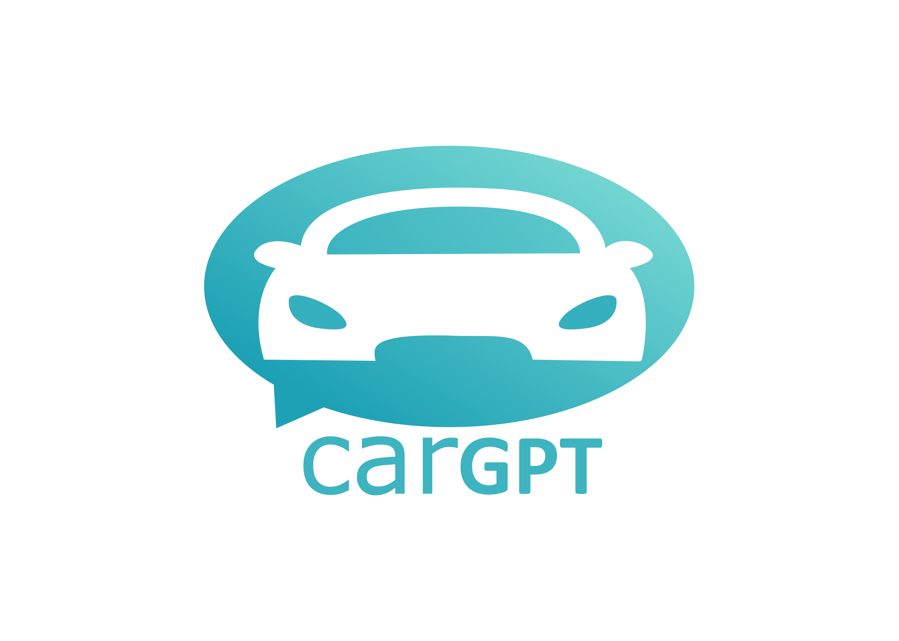
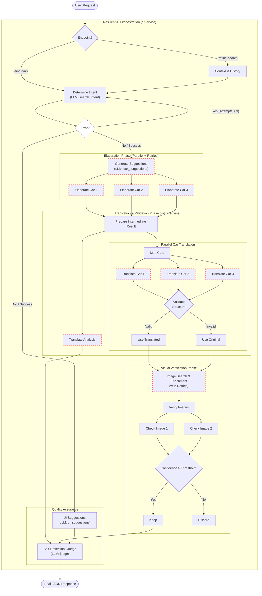

# CarGPT 🚗

<div align="center">



**Find your perfect car using AI - describe what you need, not what you think you want!**

[](https://opensource.org/licenses/MIT)
[](https://nodejs.org)
[](https://ollama.ai)
[](https://programmablesearchengine.google.com/)
[](https://react.dev)
[](https://vitejs.dev)
[](https://www.chakra-ui.com)
[](CONTRIBUTING.md)
[](https://github.com/lucapalomba/carGPT)
[](https://github.com/lucapalomba/carGPT)

[Features](#features) • [Demo](#demo) • [Installation](#installation) • [Usage](#usage) • [API Docs](docs/API.md) • [Contributing](#contributing)

</div>

---

## 🎯 What is CarGPT?

CarGPT is an **AI-powered car recommendation system** that helps you find the perfect car based on your actual needs - not by searching through endless lists of makes and models.

**Instead of asking** "What do you know about a BMW 3 Series?"

**CarGPT asks** "What do you need from a car?" and then suggests the best options for you, tailoring results to your **local market** and **preferred language**.

### The Problem

Shopping for a car is overwhelming:
- 🤯 Too many models to choose from
- 📊 Hard to compare features objectively  
- ❓ Don't know which models fit your needs
- 💸 Difficult to find best value for money

### The Solution

CarGPT uses AI to:
1. **Understand** your needs in natural language
2. **Analyze** the entire car market
4. **Suggest** 3 personalized recommendations

### 💡 Project Philosophy

This project was born as an exercise to explore how modern AI tools can create dynamic user interfaces. Instead of a traditional static table filled with potentially irrelevant data, the goal is to provide a conversational experience that adapts specifically to the user's prompt and needs.

---

## ✨ Features

### 🤖 AI-Powered Recommendations
- Describe your needs in **plain language**
- Get **3 personalized suggestions** with detailed analysis
- See why each car is recommended for **your** specific case


### 🏘️ AI-Powered Image Verification (VLM)
- Uses **Ollama Vision** (e.g., LLaVA, BakLLaVA) to analyze car images
- **Automatic Filtering**: Removes incorrect car models or low-quality results
- Ensures you only see the cars you are actually looking for

### ⚛️ Modern Tech Stack
-   **Frontend**: React 19 + TypeScript + Vite
-   **Styling**: Chakra UI v3 for a premium, accessible, and composable UI
-   **Backend**: Node.js + Express
-   **Monorepo**: Clean workspace management with NPM Workspaces

### 🆓 100% Private Car Search
- Uses **Ollama** - runs locally on your machine
- **100% private** - your core analysis and **image vision verification** never leave your computer
- **Google Images Integration**: Fetches real car photos via Google Custom Search API
- **No registration** required

---

## 🎬 Demo

### 1. Describe Your Needs

```
I need a family car with space for 5 people and a large trunk 
for at least 3 suitcases. I'll use it for daily commutes (40km) 
and weekend trips. Budget: max €30,000. Good fuel economy and 
reliability are important.
```

### 2. Get Personalized Suggestions

The AI analyzes your needs and suggests 3 ideal cars:
- **Skoda Octavia Wagon** - Best for space and reliability
- **Peugeot 5008** - Best for versatility and tech
- **Renault Scenic** - Best value for money

---

## 🚀 Quick Start

### Prerequisites

- **Node.js 18+** ([Download](https://nodejs.org))
- **Ollama** ([Download](https://ollama.ai))

### Installation

```bash
# 1. Install Ollama
# Windows: https://ollama.ai/download
# macOS: brew install ollama
# Linux: curl -fsSL https://ollama.ai/install.sh | sh

# 2. Download the Ministral model
ollama pull ministral

# 3. Start Ollama (keep this running!)
ollama serve

# 4. In a new terminal, clone and setup CarGPT
git clone https://github.com/lucapalomba/CarGPT.git
cd CarGPT
npm install

# 5. Create config file and add API keys
cp apps/server/.env.example apps/server/.env
# Edit apps/server/.env and add GOOGLE_API_KEY and GOOGLE_CX

# 6. Start the applications
# Development: starts both web and server with Swagger UI enabled
npm run dev

# Production: build and start (Swagger/Debug APIs are disabled)
# NODE_ENV=production npm run start

# 7. Open your browser
# Visit Frontend: http://localhost:5173
# Visit Backend API: http://localhost:3001

# 8. (Optional) View API Documentation
# Visit: http://localhost:3001/api-docs
```

### 🛠️ Advanced Configuration

You can fine-tune the AI's behavior by modifying the `.env` file:

| Variable | Description | Default |
|----------|-------------|---------|
| `VISION_MODEL_CONFIDENCE_THRESHOLD` | Min confidence (0-1) to accept a car match | `0.8` |
| `VISION_TEXT_CONFIDENCE_THRESHOLD` | Max confidence (0-1) allowed for text/overlays | `0.2` |
| `VISION_TEXT_CONFIDENCE_THRESHOLD` | Max confidence (0-1) allowed for text/overlays | `0.2` |
| `CAROUSEL_IMAGES_LENGHT` | Number of images to verify/show per car (max 10) | `1` |
| `LANGFUSE_PUBLIC_KEY` | Public key for Langfuse tracing | `pk-lf-...` |
| `LANGFUSE_SECRET_KEY` | Secret key for Langfuse tracing | `sk-lf-...` |
| `LANGFUSE_BASE_URL` | Langfuse Host (Cloud or Local) | `https://cloud.langfuse.com` |
| `AI_RETRY_COUNT` | Number of retries for AI processing steps | `2` |

That's it! 🎉

---

## 📖 Usage Examples

### Example 1: Family Car
```
Looking for a reliable family car with:
- Space for 2 adults and 2 kids
- Large trunk (3 suitcases minimum)
- Good safety ratings
- Economical for daily 50km commute
- Budget: €25,000-35,000
```

**Result**: Skoda Octavia Wagon, Peugeot 5008, VW Golf Variant

### Example 2: City Commuter
```
Need a compact car for city driving:
- Easy to park
- Low fuel consumption
- Nimble in traffic
- Budget-friendly (under €20k)
- Hybrid preferred
```

**Result**: Toyota Yaris Hybrid, Fiat 500, Honda Jazz

### Example 3: Adventure SUV
```
Looking for a robust SUV for outdoor adventures:
- 4x4 capability
- Good ground clearance
- Reliable in tough conditions
- Can handle dirt roads and snow
- Budget: up to €40,000
```

**Result**: Dacia Duster, Suzuki Vitara, Subaru Forester

---

CarGPT follows a modern **Monorepo** architecture using **NPM Workspaces**.

### AI Orchestration Flow



- **Frontend (`apps/web`)**: React 19, TypeScript, Chakra UI v2
- **Backend (`apps/server`)**: Node.js, Express, TypeScript, MVC + Service Layer. AI logic is split into specialized micro-services (`intent`, `suggestion`, `elaboration`, `translation`, `enrichment`).
- **Logging**: Centralized structured logging with Winston + Seq for real-time log analysis.
- **Observability**: **Langfuse** integration for tracing LLM chains, latency, and costs (token usage).
- **Monorepo**: Centralized management via root `package.json`

For a deep dive into the system design, see [**ARCHITECTURE.md**](ARCHITECTURE.md).

---

## 📚 Documentation

- [**API Documentation**](docs/API.md) - Complete API reference
- [**Swagger UI**](http://localhost:3000/api-docs) - Interactive UI (Development mode only)
- [**Logging Guide**](apps/server/LOGGING.md) - Structured logging & LLM prompt tracking
- [Deployment Guide](docs/DEPLOYMENT.md) - Production deployment instructions
- [Contributing Guide](CONTRIBUTING.md) - How to contribute
- [Changelog](CHANGELOG.md) - Version history
- [Security Policy](SECURITY.md) - Security guidelines

---

## 🧪 Testing

CarGPT maintains a comprehensive automated testing suite to ensure reliability and performance.

### Test Suites
- **Unit Tests**: Isolated logic testing for services and utilities.
- **Integration Tests**: End-to-end API lifecycle testing using Supertest.
- **E2E Tests**: Real browser automation for critical user flows using Playwright.

### Running Tests
```bash
# Run all automated tests (Unit + Integration + E2E)
npm run test

# Run individual suites
npm run test:unit
npm run test:int
npm run test:e2e

# Generate detailed coverage reports
npm run test:coverage
```

---

## 🤝 Contributing

We love contributions! See [CONTRIBUTING.md](CONTRIBUTING.md) for details.

### Quick Contribution Guide

1. Fork the repository
2. Create your feature branch (`git checkout -b feature/amazing-feature`)
3. Commit your changes (`git commit -m 'Add amazing feature'`)
4. Push to the branch (`git push origin feature/amazing-feature`)
5. Open a Pull Request

### Areas We Need Help

- 🐛 Bug fixes and testing
- 🎨 UI/UX improvements
- 🌍 Translations (fully automated via browser language detection)
- 📝 Documentation improvements
- ✨ New features (see [issues](https://github.com/lucapalomba/CarGPT/issues))

---

## 💡 Why Ollama + Ministral?

| Feature | Cloud APIs | CarGPT (Ollama) |
|---------|-----------|-----------------|
| Cost | $0.05-0.20/query | **FREE** |
| Privacy | ❌ Cloud processing | ✅ 100% Local |
| Rate Limits | ✅ Limited | ✅ Unlimited |
| Internet Required | ✅ Yes | ❌ No (after setup) |
| Speed | Network latency | Direct (faster!) |
| Setup | API keys, billing | One command |

---

## 🐛 Troubleshooting

### "Cannot connect to Ollama"
```bash
# Make sure Ollama is running
ollama serve
```

### "Model ministral not found"
```bash
# Download the model
ollama pull ministral
```

### Responses are slow
- Ministral typically takes 10-30 seconds per response
- If you have an NVIDIA GPU, it will be used automatically
- For faster responses, try `phi3` (less accurate but faster)

### More issues?
Check our [Issues page](https://github.com/lucapalomba/CarGPT/issues) or open a new one!

---

## 📄 License

This project is licensed under the MIT License - see the [LICENSE](LICENSE) file for details.

---

## 🙏 Acknowledgments

- **Ollama team** for making local LLMs accessible
- **Mistral AI** for the Ministral model
- **Contributors** who make this project better

---

## 📧 Contact

- **GitHub Issues**: [Report bugs or request features](https://github.com/lucapalomba/CarGPT/issues)
- **Discussions**: [Ask questions or share ideas](https://github.com/lucapalomba/CarGPT/discussions)

---

<div align="center">

**Made with ❤️ for car enthusiasts who want AI-powered help finding their perfect ride**

⭐ Star this repo if you find it useful!

[Report Bug](https://github.com/lucapalomba/CarGPT/issues) • [Request Feature](https://github.com/lucapalomba/CarGPT/issues) • [Documentation](docs/)

</div>
